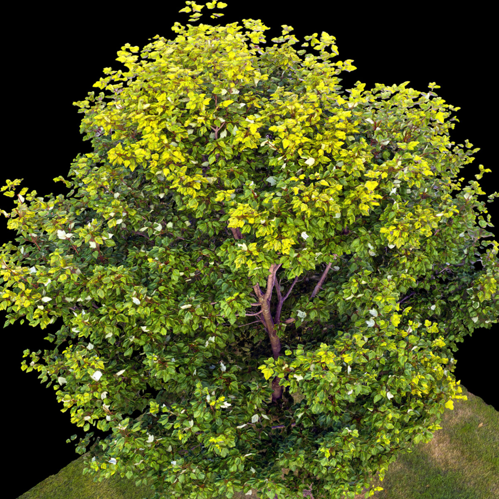
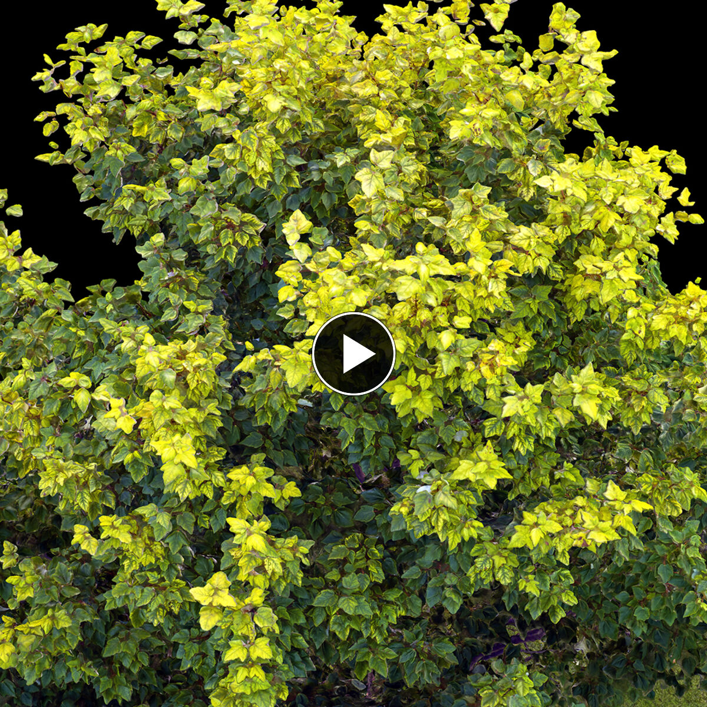
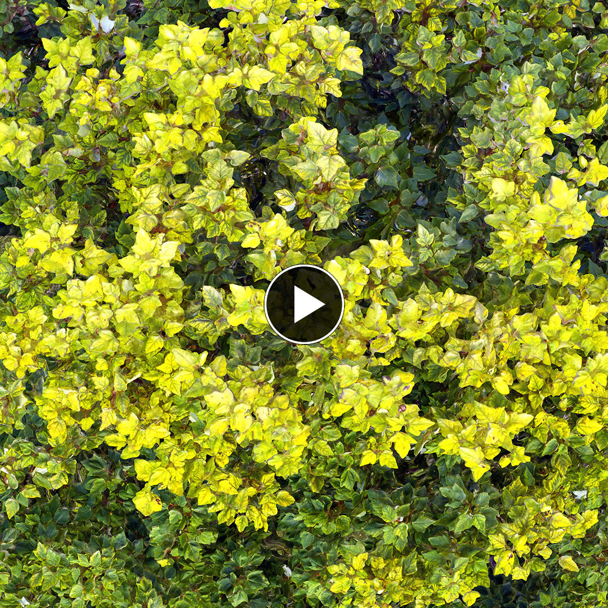
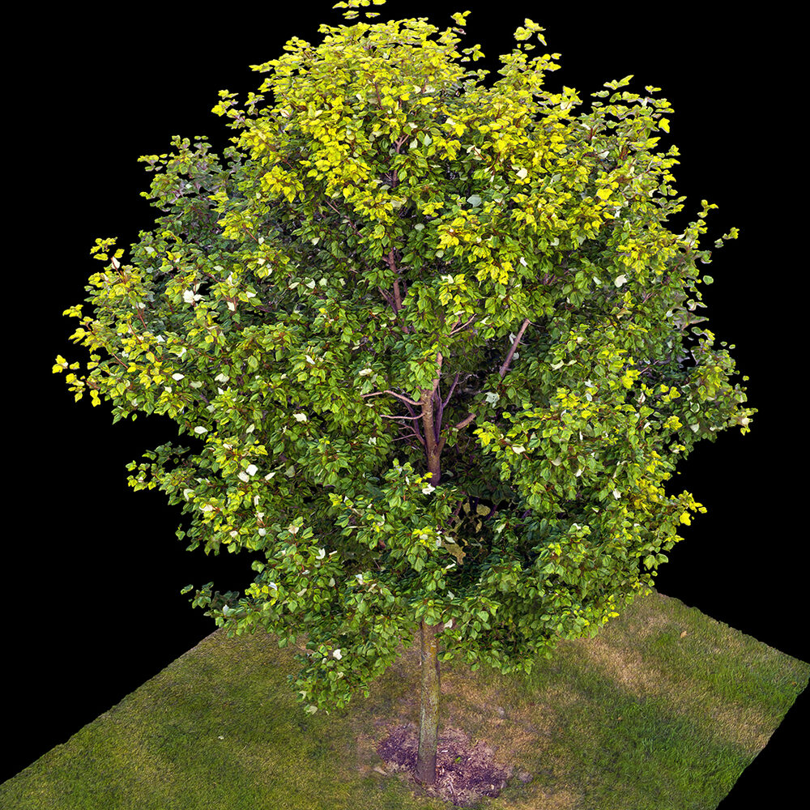
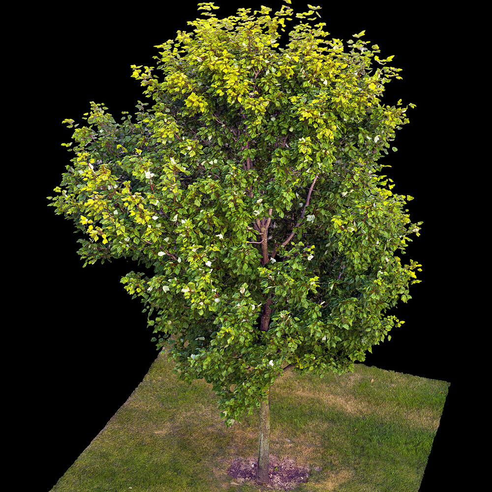
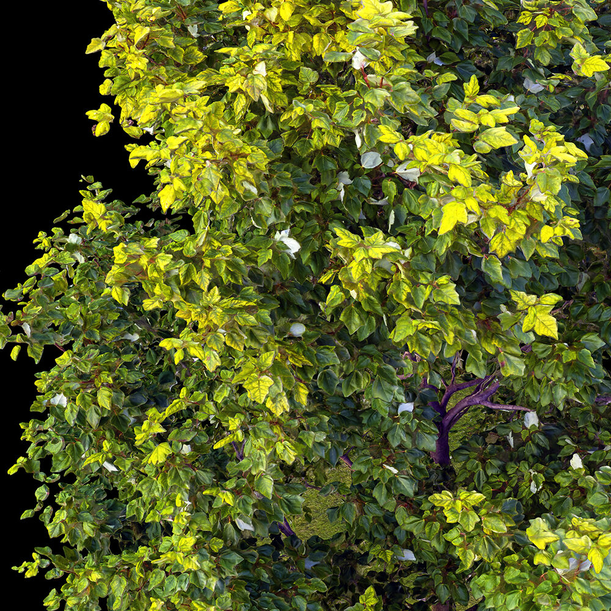
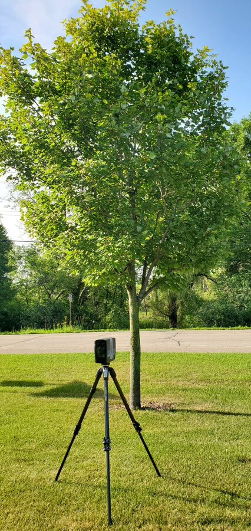

# Single Tree — High-Density Photogrammetry Dataset

**812 photos of one mature deciduous tree, flown from 0.5 to 7.9 m above the ground. 14.1 GB.
807 align, and the solved camera poses ship with it in **COLMAP format** — point a Gaussian
splatting pipeline straight at it, no structure-from-motion run required.** CC BY 4.0.

## ⬇ Download

### **[→ huggingface.co/datasets/Matt1up/tree-minnetonka-photogrammetry](https://huggingface.co/datasets/Matt1up/tree-minnetonka-photogrammetry)**

Browse the **Files** tab and take what you want — no account needed. The 14 GB of imagery lives
there because GitHub won't host files that size; this repo holds docs, checksums and poses.

[Sample image](https://huggingface.co/datasets/Matt1up/tree-minnetonka-photogrammetry/resolve/main/images/The_Tree-1.jpg)
 · [command-line options](#download)

---


> ## 🏆 Winner — RealityCapture #RCmonthlyChallenge, August 2020
>
> This reconstruction and its [companion Chicago city scan](https://github.com/Matt1Up/chicago-photogrammetry-dataset) were both named
> winners of Capturing Reality's monthly challenge, announced by **RealityScan** — the makers
> of RealityCapture — on 17 September 2020 in
> **[Winners of AUGUST #RCmonthlyChallenge ▶](https://www.youtube.com/watch?v=PfzdaZbUrFc)**.
>
> The video description credits the win as *"@Matt1up — Tree and Chicago city"*, and the
> tree model appears in the reel under a `created by: @Matt1up` title card.



---

## The tree

There's a tree up the street from where I lived in Minnetonka. I watched the leaves out my
window for a few days, and when they went completely still I'd grab the drone and the scanner,
drive the three blocks up there, and fly.

A few times the wind picked back up and I packed it in and went home. I got two good sessions,
18 and 20 July 2020.

No wind is why it aligns.

812 photos, flown between 0.5 and 7.9 m above the ground. 807 align. Camera poses are
included, so you can skip COLMAP.

## The reconstruction

[](https://vimeo.com/485263810)

*Finished reconstruction — click to watch on Vimeo*

[](https://vimeo.com/494607575)

*Capture and processing — click to watch on Vimeo*

Full project write-up: **[mattguertin.com/portfolio/tree](https://mattguertin.com/portfolio/tree/)**

| | | |
|---|---|---|
|  |  |  |

## What's in the dataset

| | |
|---|---|
| **Images** | 812 JPEG · 14.06 GB |
| **Alignment** | 807 / 812 images solve |
| **Sensor** | Hasselblad L1D-20c — 1" 20 MP CMOS (DJI Mavic 2 Pro) |
| **Resolution** | 5464 × 3640 |
| **Lens** | 10.3 mm — 28 mm full-frame equivalent, f/2.8 |
| **Geotagging** | GPS latitude / longitude / altitude in EXIF, all 812 images |
| **Location** | Minnetonka, MN — 44.944 N, −93.426 W |
| **Captured** | 18 and 20 July 2020 |
| **Camera poses** | included — 807 solved cameras + 1.2M tie points ([`poses/`](https://github.com/Matt1Up/tree-photogrammetry-dataset/tree/main/poses)) |

### Capture tiers

Two sessions, two days apart, at different heights. The low and mid tiers are hover passes at
knee and chest height with the camera angled up, covering the trunk and the underside of the
canopy.

| group | images | date | height above takeoff | gimbal pitch |
|---|---:|---|---|---|
| `Original_low` | 85 | 2020-07-18 | +0.5 m (fixed) | +4.2° to +8.2° |
| `Original_mid` | 68 | 2020-07-18 | +1.7 to +4.0 m | −8.0° to +2.7° |
| `The_Tree` | 659 | 2020-07-20 | +1.3 to +7.9 m | −53.1° to +17.5° |
| **total** | **812** | | | |

Heights and gimbal angles are read from EXIF across every frame in each group, not sampled.
Positive gimbal is pointing upward.

## The capture rig



Photography flown with a **DJI Mavic 2 Pro** (Hasselblad L1D-20c). EXIF records processing in
Adobe Lightroom Classic 9.3.

A FARO Focus S150 was on site too. Its data is not in this release — this is the photographs
only.

## Camera poses

[`poses/`](https://github.com/Matt1Up/tree-photogrammetry-dataset/tree/main/poses) has 807 solved cameras with intrinsics and extrinsics, plus a
1,206,765-point sparse cloud. Same thing COLMAP would give you, so you can skip that step and
go straight to **Gaussian splatting (3DGS)**, NeRF, or meshing — poses plus tie points is
exactly what those pipelines ingest.

| | |
|---|---|
| `poses/colmap/` | **COLMAP sparse reconstruction** — `cameras.txt`, `images.txt`, `points3D.txt` |
| `poses/xmp/` | 807 XMP sidecars, named to match `images/` |
| `poses/cameras.csv` | the same data as one table |
| `poses/suspect_cameras.txt` | 4 cameras with implausible solved focal lengths |
| `poses/unaligned.txt` | the 5 that did not solve |
| `tiepoints.ply` | 1.2M sparse points, 77 MB — hosted with the images, not in git |

Solved in RealityScan 2.2, which is free, then converted to COLMAP format by
[`scripts/xmp-to-colmap.py`](https://github.com/Matt1Up/tree-photogrammetry-dataset/blob/main/scripts/xmp-to-colmap.py). The converter does not assume the
camera-frame convention — it tests both by reprojecting tie points and keeps whichever puts
them in front of the cameras. See [`poses/colmap/README.md`](https://github.com/Matt1Up/tree-photogrammetry-dataset/blob/main/poses/colmap/README.md).

```bash
hf download Matt1up/tree-minnetonka-photogrammetry --repo-type dataset --local-dir ./tree --include 'colmap/*'   # points3D.txt, 56 MB
```

The 5 that didn't align are all from the low and mid tiers, none from `The_Tree`.
Four more solved to an impossible focal length and are listed in
[`poses/suspect_cameras.txt`](https://github.com/Matt1Up/tree-photogrammetry-dataset/blob/main/poses/suspect_cameras.txt) — worth dropping before training.

## Download

**→ [huggingface.co/datasets/Matt1up/tree-minnetonka-photogrammetry](https://huggingface.co/datasets/Matt1up/tree-minnetonka-photogrammetry)**

Click the **Files** tab and download whatever you want in a browser — no tooling, no account.
The images live there; the [GitHub repo](https://github.com/Matt1Up/tree-photogrammetry-dataset)
holds the documentation, manifests, checksums and camera poses.

**One file, straight from a browser or the shell:**

```bash
curl -LO https://huggingface.co/datasets/Matt1up/tree-minnetonka-photogrammetry/resolve/main/images/The_Tree-1.jpg
```

**Everything, one command.** Run it again if it stops — finished files are skipped.

```bash
pip install -U huggingface_hub
hf download Matt1up/tree-minnetonka-photogrammetry --repo-type dataset --local-dir ./tree
```

Take part of it with `--include`: `'sample/*'` (~420 MB, look before committing to 14 GB),
`'images/*'`, `'colmap/*'`, or `'images/Original_low*'` for one capture group.

**Everything, as a git repo** (needs git-lfs):

```bash
git clone https://huggingface.co/datasets/Matt1up/tree-minnetonka-photogrammetry
```

**Or the helper scripts** from the [GitHub repo](https://github.com/Matt1Up/tree-photogrammetry-dataset),
which wrap the same command and add `verify.sh` to check every image against the published
SHA-256 list:

```bash
git clone https://github.com/Matt1Up/tree-photogrammetry-dataset && cd tree-photogrammetry-dataset

./scripts/download.sh --sample     # ~420 MB, look before committing to 14 GB
./scripts/download.sh --full       # everything
./scripts/download.sh --colmap     # points3D.txt for splatting
./scripts/download.sh --group Original_low --group Original_mid
./scripts/verify.sh
```

More detail in **[docs/download.md](https://github.com/Matt1Up/tree-photogrammetry-dataset/blob/main/docs/download.md)**.

## Reproducing the reconstruction

See **[docs/reproduce.md](https://github.com/Matt1Up/tree-photogrammetry-dataset/blob/main/docs/reproduce.md)** for alignment settings. The images are ordinary
geotagged JPEGs, so any structure-from-motion tool will read them — RealityScan, Metashape,
COLMAP, Meshroom.

Expect ~807/812. The solved alignment is in [`poses/`](https://github.com/Matt1Up/tree-photogrammetry-dataset/tree/main/poses) if you want something to compare
against.

## Notes

- **No wind.** Both sessions were flown in still air. A windy recapture would not align the
  same.
- **The 153 low/mid images had their metadata repaired.** These were exported through
  RealityCapture, which stripped all EXIF. The original camera metadata — make, model, GPS,
  timestamp, exposure — was grafted back on from the untouched 16-bit source files.
  **Pixel data is byte-identical to the export; only the metadata block was rewritten.**
  Verified: decoded-RGB checksums match before and after.
- **Filenames were normalised.** Those same 153 files carried a RealityCapture double extension
  (`Original_low-10.png.geometry.jpg`). Renamed to `Original_low-10.jpg`. Content untouched.
- **16-bit originals exist for 153 images.** The low and mid tiers have 16-bit PNG masters
  (~100 MB each, 15 GB total). Not included — they would double the download and no
  photogrammetry pipeline needs them. Open an issue if you want them.
- **These are Lightroom exports.** EXIF records Lightroom Classic 9.3. Original camera files are not part of this release.

## Licence

[](https://creativecommons.org/licenses/by/4.0/)

Released under [Creative Commons Attribution 4.0 International](LICENSE).
**You may use this commercially, and you may train models on it.** You must give credit.

```
Single Tree Photogrammetry Dataset — Matthew Guertin, 2020.
Licensed CC BY 4.0. https://github.com/Matt1Up/tree-photogrammetry-dataset
```

See [CITATION.cff](https://github.com/Matt1Up/tree-photogrammetry-dataset/blob/main/CITATION.cff) for BibTeX and academic citation formats.

## Related

- **[Chicago / Grant Park dataset](https://github.com/Matt1Up/chicago-photogrammetry-dataset)** —
  2,751 aerial images and 43 laser stations over downtown Chicago.
- **[mattguertin.com](https://mattguertin.com)** — portfolio and other work.

---

Captured, processed and released by **Matthew Guertin**.
If you build something with this, I would genuinely like to see it — open an issue.
